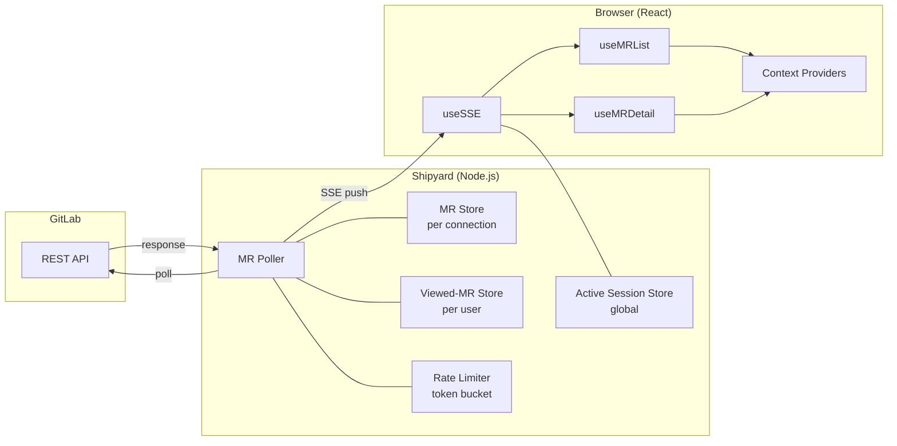

# Architecture

This document is a technical orientation for engineers working on Shipyard. It covers the runtime architecture, data flow, key abstractions, and the patterns used throughout the codebase.

## System Overview

Shipyard is a Next.js 16 application that acts as a real-time frontend for GitLab merge request data. The server polls the GitLab API on a configurable interval, maintains ephemeral per-connection state, and pushes changes to the browser over Server-Sent Events. The browser renders everything in a single persistent shell — no full page loads occur after initial authentication.



There is no database. All server state is ephemeral and in-memory. User preferences are stored in a browser cookie. The only durable data lives in GitLab.

## Authentication

Auth.js v5 handles OAuth with GitLab as the sole provider. Sessions use a JWT strategy — the access token, refresh token, and expiry are stored in an httpOnly cookie.

Token refresh is automatic: when the access token is within 60 seconds of expiry, the JWT callback refreshes it. A mutex prevents concurrent refresh attempts. Transient errors (network failures, 5xx responses) trigger exponential backoff with jitter rather than immediately invalidating the session.

Key files:
- `src/lib/auth.ts` — Auth.js configuration, token refresh logic, session callbacks
- `src/lib/auth-helpers.ts` — `getAuthenticatedSession()` and `getAccessToken()` used by API routes

## Server-Side Data Flow

### Polling and SSE

When a browser opens Shipyard, the client establishes an SSE connection to `/api/sse`. The server starts a per-connection polling loop that:

1. Fetches all open MRs for the configured group via `gitlabFetchAllPages()`
2. On the first poll, populates an in-memory `MRStore` and sends the full list as an `mr-list` event
3. On subsequent polls, diffs the fresh data against the store and emits only deltas: `mr-new`, `mr-update`, `mr-removed`
4. Separately polls approval and merge status for whichever MR the user is currently viewing, emitting `mr-detail-update` when those change

Change detection compares specific fields — `updated_at`, `detailed_merge_status`, `draft`, `title`, `has_conflicts`, and `head_pipeline.status`. GitLab's `updated_at` alone is insufficient because it does not change on approve/unapprove actions, which is why approvals are polled independently for the viewed MR.

Connection health is tracked and communicated to the client: `hydrating` during the first poll, `ready` once data is flowing, and `degraded` after three consecutive poll failures.

Key files:
- `src/app/api/sse/route.ts` — SSE endpoint, connection lifecycle, session displacement
- `src/lib/mr-poller.ts` — Polling loop, diff logic, event emission
- `src/lib/mr-store.ts` — Per-connection MR state (a `Map<number, MRSummary>`)

### SSE Event Catalog

| Event | Payload | When |
|---|---|---|
| `status` | `{ state: "hydrating" \| "ready" \| "degraded" }` | Poller state changes |
| `mr-list` | `MRSummary[]` | Initial hydration (first poll only) |
| `mr-new` | `MRSummary` | New MR appears in the group |
| `mr-update` | `MRSummary` | Existing MR changed |
| `mr-removed` | `{ id: number }` | MR no longer open |
| `mr-ready-to-merge` | `MRSummary` | MR becomes mergeable and is not a draft |
| `mr-detail-update` | `{ mr, approvals }` | Viewed MR's approval/merge status changed |
| `warning` | `{ code, message }` | Transient poll failure |
| `error` | `{ code, message }` | Terminal error (auth expired, group unavailable) |
| `session-displaced` | `{ code, message }` | Another tab took over this user's session |

Event types are defined in `src/lib/types/events.ts`.

### Server State Stores

All stores are in-memory singletons (or per-connection instances) with no persistence.

**MR Store** (`src/lib/mr-store.ts`) — one instance per SSE connection. Holds the latest `MRSummary` map for diffing against fresh poll results. Created when the SSE connection opens, garbage collected when it closes.

**Viewed-MR Store** (`src/lib/viewed-mr-store.ts`) — global singleton. Tracks which MR each user is currently viewing so the poller knows what to fetch approval details for. Set by API route handlers when detail data is requested; cleared on SSE disconnect.

**Active Session Store** (`src/lib/active-session-store.ts`) — global singleton. Maps each user to their active SSE connection's tab ID and a displacement callback. When a second tab connects for the same user, the store invokes the old tab's callback (which sends a `session-displaced` event and closes the stream). Both this and the viewed-MR store use `globalThis` storage to survive HMR in development.

### GitLab Client and Rate Limiting

All GitLab API calls go through two functions in `src/lib/gitlab-client.ts`:

- `gitlabFetch<T>()` — single request with a 30-second timeout, up to 2 retries on transient errors (408, 429, 5xx), and exponential backoff with jitter. Honors `Retry-After` headers on 429 responses.
- `gitlabFetchAllPages<T>()` — paginated variant that follows `x-total-pages`, capped at 50 pages.

Every outbound request acquires a token from a token-bucket rate limiter (`src/lib/rate-limiter.ts`) before firing. The bucket holds 2000 tokens and refills at 2000/minute. If the bucket is exhausted, `acquire()` blocks until tokens are available.

Inbound API routes are protected by a separate per-IP sliding-window rate limiter (`src/lib/inbound-rate-limiter.ts`): 120 requests per IP per 60-second window.

### API Route Pattern

All API routes under `src/app/api/gitlab/` follow a consistent structure:

1. Authenticate — `getAuthenticatedSession()` + `getAccessToken()`
2. Validate — path parameters through `validateNumericId()`, request bodies through `parseBody<T>()`
3. Fetch — call `gitlabFetch` or `gitlabFetchAllPages` with the user's token
4. Transform — map GitLab API responses (snake_case) to internal types (camelCase) where needed
5. Return — `NextResponse.json()`
6. Catch — `handleApiRouteError()` maps exceptions to appropriate HTTP status codes and error codes

The centralized error handler (`src/lib/api-error-handler.ts`) classifies errors: `ValidationError` → 400, `GitLabApiError` → mapped by status, auth failures → 401, and everything else → 500. GitLab 5xx errors are normalized to 502 for the client.

## Type System

Domain types live in `src/lib/types/`:

- `gitlab.ts` — Raw GitLab REST API response shapes (snake_case fields)
- `mr.ts` — Internal domain types (`MRSummary`, `MRUser`, `MRPipeline`) plus mapper functions that transform GitLab types to internal ones
- `events.ts` — SSE event type discriminated union
- `preferences.ts` — `UserPreferences`, `Theme`, the `THEMES` registry, and the `isTheme()` type guard

The GitLab-to-internal type boundary is explicit. Mapper functions in `mr.ts` (`mapMRSummary`, `mapUser`, `mapPipeline`) are the only place where snake_case GitLab fields are translated to camelCase internal fields.

## Client-Side Architecture

### Component Tree

```
<html data-theme={theme}>               ← set server-side from cookie
└── SessionProvider                      ← next-auth
    └── Dashboard                        ← client component boundary
        └── [Provider stack]             ← 6 nested context providers
            ├── TopBar
            │   ├── NotificationBell + NotificationPanel
            │   └── User menu + PreferencesModal
            ├── Sidebar
            │   ├── FilterTabs (mine / to-review / all)
            │   ├── SortControl
            │   └── MR list (scrollable)
            ├── MainContent
            │   ├── MROverview (collapsible header)
            │   ├── ActionButtons (approve, merge, open in GitLab)
            │   ├── TabBar
            │   └── Active tab content
            │       ├── ChangesTab (diff viewer + file tree)
            │       ├── CommitsTab
            │       ├── DiscussionsTab
            │       ├── PipelineTab (stages + job log viewer)
            │       └── HistoryTab
            ├── ErrorBar / WarningBar
            ├── ToastContainer
            └── SessionDisplacedOverlay
```

The root layout (`src/app/layout.tsx`) and page (`src/app/page.tsx`) are async server components. `layout.tsx` reads the theme from the preference cookie and sets `data-theme` on `<html>` to avoid a flash of wrong theme. `page.tsx` gates on authentication and redirects to sign-in if needed. Everything below `Dashboard` is client-rendered.

### Context Providers

`Dashboard.tsx` nests six providers, each owning one concern:

| Provider | Provides | Persistence |
|---|---|---|
| `MRSelectionProvider` | Selected MR, selection callback, detail version counter | None (in-memory) |
| `DetailPatchProvider` | Queued approval/merge patches from SSE, consume callback | None (in-memory) |
| `FilterSortProvider` | Active filter tab, sort field, sort direction | None (in-memory) |
| `UIPanelProvider` | Sidebar open/closed, active tab, cross-tab scroll target | None (in-memory) |
| `PreferencesProvider` | User preferences, update callback | Cookie (`shipyard_prefs`) |
| `ToastProvider` | Toast queue, add/dismiss callbacks | None (in-memory) |

There is no Redux, Zustand, or other state library. React Context plus hooks handle all client state.

### Key Hooks

**`useSSE`** — manages the `EventSource` connection to `/api/sse`. Generates a persistent tab ID (UUID in localStorage), handles reconnection with exponential backoff (1s → 30s), and stops reconnecting if the session is displaced.

**`useMRList`** — consumes SSE events and maintains the MR list as React state. Dispatches `mr-list` to full replacement, `mr-new` to append, `mr-update` to in-place update, `mr-removed` to filter. Exposes callbacks for event types that other parts of the app care about (notifications, detail patches).

**`useMRDetail`** — triggered when the selected MR changes. Fetches detail data in parallel via `Promise.allSettled` (MR detail + approvals, diffs, discussions, commits, pipelines). When an `mr-detail-update` SSE event arrives, it applies the patch optimistically for snappy approval UI, then schedules a silent background refetch for discussions and other secondary data.

**`usePreferences`** — reads preferences from the cookie on mount, writes back on change, and syncs the `data-theme` attribute on `<html>` whenever the theme changes.

**`useNotifications`** — in-memory notification history with unread count. Used by `Dashboard` to track MR events worth surfacing (new MR, assigned, ready to merge).

**`useAudio`** — plays notification sounds (new MR chime, assigned chime, ready-to-merge chime) gated on user preference toggles.

### Client Data Flow

```
SSE EventSource (/api/sse)
  │
  ▼
useSSE (connection management, reconnect)
  │
  ▼
useMRList (MR list state, event dispatch)
  │
  ├──► MR list → Sidebar renders MR cards
  │
  ├──► mr-new / mr-ready-to-merge callbacks
  │     └──► Dashboard routes to useNotifications + useToasts + useAudio
  │
  └──► mr-detail-update callback
        └──► DetailPatchProvider.pushDetailPatch()
              └──► useMRDetail consumes patch, applies optimistically, refetches
```

### Styling

CSS Modules with CSS custom properties. No utility classes, no Tailwind.

Every visual value — colors, spacing, typography, shadows, radii — is a CSS variable defined in the theme layer (`src/styles/theme/`). Component styles reference these variables exclusively, which is what makes theme switching instantaneous (change `data-theme` on `<html>`, all variables resolve to new values, no re-render needed).

Theme files live in `src/styles/theme/themes/` with one file per theme. Each file defines the full token set scoped to its `[data-theme="..."]` selector. The Classic theme also declares on `:root` so it serves as the default.

A build-time validation script (`scripts/validate-theme-css.mjs`, run via `npm run check:themes`) enforces that every theme file declares all required tokens, correct selectors, and a valid `color-scheme`.

For full theming details, see [`THEMING.md`](THEMING.md).

## Security

- **CSP**: restrictive Content-Security-Policy in `next.config.mjs` — `default-src 'self'`, no external scripts or connections, `frame-ancestors 'none'`
- **XSS**: all rendered markdown/HTML is sanitized through DOMPurify
- **Auth**: JWT in httpOnly cookies (immune to XSS token theft), automatic token refresh
- **Input validation**: numeric IDs and discussion IDs validated via regex before use in API calls
- **Error sanitization**: GitLab error details are not forwarded verbatim to the client; internal errors return generic messages
- **Headers**: `X-Frame-Options: DENY`, `X-Content-Type-Options: nosniff`, `Referrer-Policy: strict-origin-when-cross-origin`, `Permissions-Policy` disabling camera/mic/geolocation

## Logging

Plain-text structured logging via `src/lib/logger.ts`. No JSON log format.

Format: `[LEVEL] [ISO-timestamp] [module] message`

Modules create loggers with `createLogger("module-name")`. Log level is controlled by the `LOG_LEVEL` environment variable (default: `INFO`). Server logs go to stdout/stderr; browser logs go to the console.
